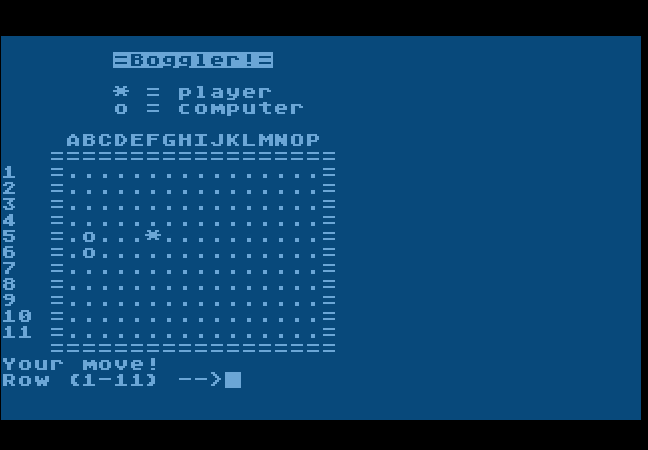

# Boggler
A board game gor Atari 8-bit computers in Atari BASIC that I wrote in high school, circa 1988. 

I *think* the goal is to get five in a row, and I think the logic is buggy, and I know the computer opponent is really slow. There's not much redeeming about this, actually.

The output is slow and text-based because it was meant to be played on a BBS (I was writing it for use on Weird City BBS.) I don't think I got it working well enough to make it available on the BBS.
